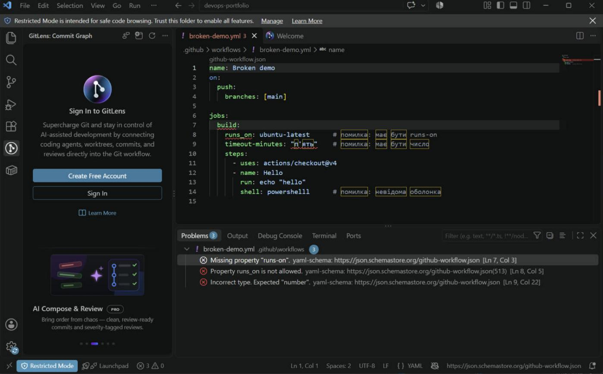

# Лабораторна робота 1 — Середовище та професійний Git workflow

**Виконала:** Олександра Тищенко · **ОС:** Windows 11 Pro

---

## Завдання 1. Git і редактор

### Глобальні параметри Git

```bash
git config --global user.name "Oleksandra Tyshchenko"
git config --global user.email "tyshchenko.oleksandra@chnu.edu.ua"
git config --global init.defaultBranch main
git config --global core.autocrlf true
git config --global pull.rebase true
git config --global core.editor "code --wait"
```

```text
$ git config --list --global
user.name=Oleksandra Tyshchenko
user.email=tyshchenko.oleksandra@chnu.edu.ua
init.defaultbranch=main
core.autocrlf=true
core.editor=code --wait
pull.rebase=true
```

| Параметр | Значення | Пояснення |
|---|---|---|
| `user.name`, `user.email` | ім'я та пошта | Пошта збігається з підтвердженою поштою GitHub-акаунта — інакше GitHub не прив'яже коміти до профілю і вони не зарахуються в активність. |
| `init.defaultBranch` | `main` | Нові репозиторії одразу створюються з гілкою `main`, як на GitHub, без перейменування `master`. |
| `core.autocrlf` | `true` (Windows) | Див. нижче. |
| `pull.rebase` | `true` | `git pull` робить `fetch` + `rebase` замість `fetch` + `merge`. |
| `core.editor` | `code --wait` | Повідомлення комітів, rebase тощо редагуються у VS Code; `--wait` змушує Git чекати, доки вкладку не закрито. |

**Чому `core.autocrlf` різний для Windows і Unix.** Windows традиційно завершує рядки
парою `CRLF` (`\r\n`), Linux і macOS — одним `LF` (`\n`). У репозиторії домовляються
зберігати `LF`. На Windows ставлять `true`: при коміті `CRLF → LF`, при checkout `LF → CRLF`,
тож редактор бачить звичні для ОС кінці рядків, а в репозиторій потрапляє `LF`. На Linux/macOS
ставлять `input`: при коміті випадкові `CRLF` перетворюються на `LF`, а при checkout нічого не
змінюється.

**Що буде без нього в змішаній команді.** Розробник на Windows відкриває файл, редактор
зберігає його з `CRLF` — і в diff змінюється *кожен* рядок файлу, хоча по суті змін немає.
Рецензія стає неможливою, `git blame` втрачає авторство, виникають фіктивні конфлікти злиття.
Гірше — shell-скрипти з `CRLF` ламаються в Linux-контейнері (`/bin/bash^M: bad interpreter`).
Тому, окрім `autocrlf`, у репозиторії лежить [`.gitattributes`](../.gitattributes) з
`* text=auto eol=lf`: він діє для всіх клонів незалежно від локальних налаштувань учасника.

**Чим історія з `pull.rebase=true` відрізняється від типової.** Типовий `git pull` при
розбіжності локальної і віддаленої гілки створює merge-коміт «Merge branch 'main' of …».
У командній роботі таких технічних комітів стає багато, історія перетворюється на «рейки» з
розгалужень. З `pull.rebase=true` мої локальні коміти переносяться *поверх* свіжих віддалених —
історія лишається лінійною, кожен коміт — це реальна зміна. Ціна: коміти переписуються
(нові хеші), тому так можна робити лише з комітами, які ще не запушено.

### Редактор — VS Code

| Потреба | Розширення |
|---|---|
| Історія змін і авторство рядків | `eamodio.gitlens` |
| Dockerfile і Compose | `ms-azuretools.vscode-containers` (+ `vscode-docker`) |
| YAML із перевіркою за схемою | `redhat.vscode-yaml`, `github.vscode-github-actions` |
| Markdown | `yzhang.markdown-all-in-one`, `davidanson.vscode-markdownlint`, `bierner.markdown-preview-github-styles` |
| `.editorconfig` | `editorconfig.editorconfig` |

```text
$ code --list-extensions --show-versions
bierner.markdown-preview-github-styles@2.2.0
davidanson.vscode-markdownlint@0.62.1
eamodio.gitlens@19.3.0
editorconfig.editorconfig@0.18.2
github.vscode-github-actions@0.32.3
ms-azuretools.vscode-containers@2.5.2
ms-azuretools.vscode-docker@2.0.0
redhat.vscode-yaml@1.24.0
yzhang.markdown-all-in-one@3.6.3
```

Налаштування робочого простору лежать у репозиторії — [`.vscode/settings.json`](../.vscode/settings.json):
увімкнено `editor.formatOnSave`, а YAML-файлам у `.github/workflows/` явно прив'язано схему
`https://json.schemastore.org/github-workflow.json` (для `compose*.yml` — схему Compose Spec).
[`.vscode/extensions.json`](../.vscode/extensions.json) пропонує ці розширення кожному, хто відкриє репозиторій.

### `.editorconfig`

[`.editorconfig`](../.editorconfig): UTF-8, `LF`, 2 пробіли (4 для Python, таб для Makefile),
фінальний перенос рядка, обрізання пробілів у кінці (крім Markdown, де два пробіли — це перенос).

Перевірка, що правила діють: без розширення EditorConfig VS Code файл ігнорує. З розширенням у
статус-барі для YAML-файлу видно `Spaces: 2` і `LF` (див. скріншот нижче), хоча глобально VS Code
на Windows за замовчуванням ставить `CRLF`.

### Скріншот: підсвічування зламаного YAML

Навмисно зламаний workflow (`runs_on` замість `runs-on`, рядок замість числа в `timeout-minutes`).
Розширення YAML перевіряє його за схемою GitHub Actions і показує помилки ще до коміту:



---

## Завдання 2. Середовища виконання

| Інструмент | Як встановлено |
|---|---|
| Node.js | [fnm](https://github.com/Schniz/fnm) (`winget install Schniz.fnm`), версії 24 LTS і 22 |
| Python | [uv](https://docs.astral.sh/uv/) (`winget install astral-sh.uv`), `uv python install 3.14` |
| Контейнери | Docker Desktop, Compose v2 (вбудований плагін `docker compose`) |

Ініціалізація fnm у профілі PowerShell (`$PROFILE`):

```powershell
fnm env --use-on-cd --shell powershell | Out-String | Invoke-Expression
```

### Перемикання між двома версіями Node.js

```text
PS> fnm list
* v22.23.3
* v24.21.0 default, lts-latest
* system
PS> fnm use 22
Using Node v22.23.3
PS> node -v
v22.23.3
PS> fnm use 24
Using Node v24.21.0
PS> node -v
v24.21.0
```

### Версії всіх інструментів

```text
PS> git --version
git version 2.54.0.windows.1
PS> node --version
v24.21.0
PS> fnm --version
fnm 1.39.0
PS> uv --version
uv 0.12.23 (46b84fd0b 2026-10-03 x86_64-pc-windows-msvc)
PS> python --version
Python 3.14.8
PS> docker --version
Docker version 29.6.1, build 8900f1d
PS> docker compose version
Docker Compose version v5.1.4
PS> gh --version
gh version 2.102.0 (2026-09-30)
PS> code --version
1.139.1
```

### Навіщо менеджер версій, коли проєктів більше одного

Різні проєкти зафіксовані на різних версіях рантайму: старий сервіс працює лише на Node 22,
новий використовує можливості Node 24, CI збирає на конкретній мажорній версії. Системний
пакет дає *одну* глобальну версію — оновивши її для одного проєкту, ламаєш інший. Менеджер версій
тримає кілька версій поруч і перемикає їх для кожного проєкту окремо (fnm з `--use-on-cd` робить
це автоматично за файлом `.node-version` / `.nvmrc` при вході в теку). Версія стає частиною
проєкту, а не стану конкретної машини: колега й CI отримують ту саму версію, і зникає
«а в мене працює». Також менеджер ставить версії в домашній каталог користувача — не потрібні
права адміністратора, і `npm i -g` не засмічує систему.

---

## Завдання 3. GitHub і доступ

- Профіль: <https://github.com/tyshchenkooleksandra-hue> — ім'я, фото, опис заповнено.
- Двофакторна автентифікація увімкнена.
- SSH-ключ `ed25519` із парольною фразою, публічна частина додана в акаунт:

```bash
ssh-keygen -t ed25519 -C "tyshchenko.oleksandra@chnu.edu.ua"
```

```text
$ ssh -T git@github.com
SSH_T_OUTPUT_PLACEHOLDER
```

### Чому приватний ключ ніколи не потрапляє в репозиторій

Приватний ключ — це і є доступ: будь-хто, хто має файл `id_ed25519`, автентифікується як я —
пушить у всі мої репозиторії, і GitHub не відрізнить його від мене. Репозиторій, особливо
публічний, копіюють, форкають, індексують боти, що спеціально шукають ключі й токени;
історія Git зберігає файл навіть після видалення в наступному коміті. Парольна фраза
лише сповільнює зловмисника (офлайн-перебір), а не захищає. Тому ключ живе тільки в `~/.ssh`
з обмеженими правами доступу, а `.gitignore` і сканування секретів (GitHub push protection)
— додаткові запобіжники.

### Що робити, якщо ключ усе ж потрапив у репозиторій

Головне — **ключ уже скомпрометовано з моменту пушу**, навіть якщо репозиторій видалили
через хвилину. Тож спочатку відкликаємо доступ, потім прибираємо сліди:

1. **Відкликати ключ.** GitHub → Settings → SSH and GPG keys → видалити цей ключ
   (`gh ssh-key delete <id>`). З цієї секунди він нічого не відкриває.
2. **Перевірити, чи ним скористалися.** Settings → Security log: нові ключі, токени, зміни в
   репозиторіях, push-и, яких я не робила. Перевірити, де ще використовувався цей ключ
   (сервери в `authorized_keys`, деплой-ключі) — і прибрати його звідти теж.
3. **Згенерувати новий ключ** із парольною фразою, додати в акаунт і на сервери, перевірити
   `ssh -T git@github.com`.
4. **Вичистити історію Git.** Простого `git rm` недостатньо — файл лишається в попередніх
   комітах. Переписати історію `git filter-repo --invert-paths --path <файл>` (або BFG),
   зробити `git push --force` усіх гілок і тегів (для цього тимчасово зняти заборону
   force-push у ruleset).
5. **Прибрати копії.** Попросити співавторів перевклонувати репозиторій; закриті PR і форки
   досі містять старі коміти — звернутися в GitHub Support для очищення кешованих view.
6. **Запобігти повторенню.** Додати шаблони ключів у `.gitignore`, увімкнути Secret scanning і
   push protection, pre-commit хук (`gitleaks`). Записати, що сталося і що змінено.

---

## Завдання 4. Портфоліо-репозиторій

Репозиторій: <https://github.com/tyshchenkooleksandra-hue/devops-portfolio>

- [`README.md`](../README.md) — представлення, мета, технології «знаю / планую», план на рік, контакти.
- [`.gitignore`](../.gitignore) — **згенеровано** сервісом gitignore.io (Toptal) під використовувані технології:

  ```bash
  curl -sL "https://www.toptal.com/developers/gitignore/api/windows,macos,linux,visualstudiocode,jetbrains+all,node,python,terraform,dotenv" -o .gitignore
  ```

  Шаблони під ОС (Windows/macOS/Linux — у команді різні системи), редактори, Node.js і Python
  (стек курсу), Terraform (Лаб. 8) і `.env` (секрети).
- [`LICENSE`](../LICENSE) — **MIT**: портфоліо створене, щоб його читали й використовували, а MIT
  дозволяє будь-яке використання коду з єдиною умовою — зберегти авторство, без зобов'язань
  відкривати похідні роботи, як у GPL.
- Структура тек: `lab-01/` … `lab-10/`, `final/`, у кожній — `README.md`-заглушка (Git не зберігає порожні теки).

---

## Завдання 5. Правила репозиторію

### Ruleset для `main`

Ruleset `protect-main` (Settings → Rules → Rulesets), ціль — гілка за замовчуванням. Створено скриптом з бонусного завдання,
активні правила перевірено через API:

```text
$ gh api repos/tyshchenkooleksandra-hue/devops-portfolio/rules/branches/main --jq '[.[].type]|join(", ")'
deletion, non_fast_forward, required_linear_history, pull_request
```


| Правило | Значення |
|---|---|
| Require a pull request before merging | ✅, 0 обов'язкових схвалень |
| Block force pushes | ✅ |
| Restrict deletions | ✅ |
| Require linear history | ✅ (дозволені методи злиття — squash і rebase) |
| Bypass list | порожній |

Додатково в налаштуваннях репозиторію вимкнено merge-коміти (лінійна історія все одно їх
забороняє) і ввімкнено автовидалення гілки після злиття.

### Що зміниться, коли робота стане командною

- **Обов'язкові схвалення:** `required_approving_review_count` з 0 → 1–2; зміни без рецензії
  іншої людини більше не потрапляють у `main`.
- **Dismiss stale approvals** — новий пуш у PR скидає старе схвалення, щоб не можна було
  отримати «ок» і дописати щось непереглянуте; **require approval of the most recent push**.
- **CODEOWNERS** і обов'язкова рецензія власника коду для критичних тек (`.github/`, інфраструктура).
- **Required conversation resolution** — не можна злити PR з невирішеними коментарями.
- **Required status checks** — після Лаб. 4, коли конвеєр уже запускався і його завдання видно в списку.
- **Bypass list** лишається порожнім — адміністратори теж ідуть через PR.

**Чому заборона обходу правил адміністратором безпечна в команді й шкідлива соло.** У команді
завжди є друга людина, яка може схвалити PR, тож заборона нікого не блокує — вона лише
гарантує, що жодна зміна, навіть від адміністратора чи зі зламаного акаунта, не потрапить у
`main` без другого погляду. Соло ж автор PR не може схвалити власний PR: якщо ввімкнути
обов'язкову рецензію і заборонити обхід, жодна зміна вже ніколи не зіллється, а зняти
блокування можна лише вимкнувши саме правило — тобто захист перетворюється на ритуал.

### Дошка проєкту

Project «DevOps course»: <https://github.com/users/tyshchenkooleksandra-hue/projects/3>

- Колонки (поле Status): **Backlog / In Progress / Review / Done**.
- Задачі: по одній на кожен модуль курсу (3) і на фінальний проєкт.
- Вбудовані автоматизації (Project → ⋯ → Workflows):
  - *Item added to project* → Backlog
  - *Pull request linked / opened* → Review
  - *Pull request merged* → Done
  - *Item closed* → Done

### Шаблон pull request

[`.github/pull_request_template.md`](../.github/pull_request_template.md): опис змін, посилання на
задачу (`Closes #`), спосіб перевірки, чек-лист самоперевірки (актуальна гілка, немає секретів,
форматування, документація).

### Здача через PR

Робота виконана в гілці `lab-01` і злита в `main` через pull request: <https://github.com/tyshchenkooleksandra-hue/devops-portfolio/pull/6>

---

## Бонус. Правила як код

Усі налаштування з Завдань 4–5 описані файлами в [`repo-config/`](../repo-config/):

| Файл | Що описує |
|---|---|
| [`repository.json`](../repo-config/repository.json) | Загальні налаштування: методи злиття, автовидалення гілок, wiki/issues |
| [`ruleset-main.json`](../repo-config/ruleset-main.json) | Ruleset для `main` у форматі REST API GitHub |
| [`project.conf`](../repo-config/project.conf) | Назва дошки й колонки |
| [`issues.tsv`](../repo-config/issues.tsv) | Задачі на модулі й фінальний проєкт |

Скрипт [`scripts/apply-repo-config.sh`](../scripts/apply-repo-config.sh) застосовує їх через `gh`
однією командою — до існуючого або до щойно створеного порожнього репозиторію:

```bash
scripts/apply-repo-config.sh tyshchenkooleksandra-hue/repo-config-test --create
```

Що робить скрипт, по кроках:

1. (`--create`) створює публічний порожній репозиторій;
2. `PATCH /repos/{repo}` з `repository.json`;
3. кладе шаблон PR і `.editorconfig` через Contents API — **до** увімкнення правил, бо після
   ruleset прямий запис у `main` заборонено;
4. створює ruleset (`POST /repos/{repo}/rulesets`) або оновлює його, якщо такий уже є —
   скрипт ідемпотентний, повторний запуск не дублює правила;
5. створює дошку Projects, замінює варіанти поля Status на Backlog / In Progress / Review / Done
   (GraphQL `updateProjectV2Field`), прив'язує її до репозиторію, створює задачі й додає їх на дошку.

**Обмеження API.** Вбудовані автоматизації дошки (workflows) GitHub не дозволяє вмикати
через API — є лише мутація їх видалення. Обхід: одного разу налаштувати дошку-шаблон і
задати її в `PROJECT_TEMPLATE` — тоді скрипт копіює її через `gh project copy`
(`copyProjectV2`), а копіювання переносить і workflows.

### Демонстрація на тестовому репозиторії

```text
$ scripts/apply-repo-config.sh tyshchenkooleksandra-hue/repo-config-test --create
==> Створюю публічний репозиторій tyshchenkooleksandra-hue/repo-config-test
https://github.com/tyshchenkooleksandra-hue/repo-config-test

==> Загальні налаштування репозиторію (repository.json)

==> Шаблон pull request і базові файли
  + .github/pull_request_template.md
  + .editorconfig

==> Ruleset 'protect-main' (ruleset-main.json)
  створено ruleset #24605188

==> Створюю дошку 'DevOps course (tyshchenkooleksandra-hue/repo-config-test)'
  колонки: Backlog In Progress Review Done

==> Задачі на кожен модуль і фінальний проєкт (issues.tsv)
  + https://github.com/tyshchenkooleksandra-hue/repo-config-test/issues/1 → Backlog
  + https://github.com/tyshchenkooleksandra-hue/repo-config-test/issues/2 → Backlog
  + https://github.com/tyshchenkooleksandra-hue/repo-config-test/issues/3 → Backlog
  + https://github.com/tyshchenkooleksandra-hue/repo-config-test/issues/4 → Backlog

  Дошка: https://github.com/users/tyshchenkooleksandra-hue/projects/4
  УВАГА: API GitHub не дозволяє вмикати вбудовані workflows дошки.
  Їх переносить лише копіювання з шаблону (PROJECT_TEMPLATE у project.conf).

==> Готово: https://github.com/tyshchenkooleksandra-hue/repo-config-test
  ruleset: protect-main [active]

# повторний запуск — нічого не дублюється, ruleset оновлюється
$ scripts/apply-repo-config.sh tyshchenkooleksandra-hue/repo-config-test
==> Загальні налаштування репозиторію (repository.json)

==> Шаблон pull request і базові файли
  .github/pull_request_template.md вже існує — пропускаю
  .editorconfig вже існує — пропускаю

==> Ruleset 'protect-main' (ruleset-main.json)
  оновлено ruleset #24605188

==> Дошка 'DevOps course (tyshchenkooleksandra-hue/repo-config-test)' вже існує (#4)

==> Задачі на кожен модуль і фінальний проєкт (issues.tsv)
  = Модуль 1: Основи DevOps та автоматизація (Лаб. 1–4) (вже існує)
  = Модуль 2: Контейнеризація та розгортання (Лаб. 5–8) (вже існує)
  = Модуль 3: Моніторинг та безпека (Лаб. 9–10) (вже існує)
  = Фінальний проєкт (вже існує)

  Дошка: https://github.com/users/tyshchenkooleksandra-hue/projects/4
  УВАГА: API GitHub не дозволяє вмикати вбудовані workflows дошки.
  Їх переносить лише копіювання з шаблону (PROJECT_TEMPLATE у project.conf).

==> Готово: https://github.com/tyshchenkooleksandra-hue/repo-config-test
  ruleset: protect-main [active]

# перевірка: прямий запис у main тестового репозиторію відхилено правилами
$ gh api -X PUT repos/tyshchenkooleksandra-hue/repo-config-test/contents/direct.txt -f message="direct push" -f content=aGk=
gh: Repository rule violations found

Changes must be made through a pull request.

 (HTTP 409)
```

Після демонстрації тестовий репозиторій видаляється (`gh repo delete … --yes`, потрібен scope `delete_repo`).

### Чому налаштування кліками — проблема для команди

- **Їх не видно.** Налаштування, зроблене в UI, ніде не записане: новий учасник не знає, які
  правила діють і чому; на питання «хто вимкнув перевірку?» відповідає лише audit log.
- **Їх не відтворити.** Другий репозиторій налаштовується знову вручну — щось обов'язково
  забувають, і репозиторії команди поступово розходяться (configuration drift).
- **Їх не рецензують.** Послаблення захисту — найризикованіша зміна, але робиться в обхід
  того самого процесу PR, який вона мала б захищати.

**Що змінюється, коли вони описані кодом:** конфігурація лежить у Git — має історію, автора й
причину зміни (повідомлення коміту), проходить рецензію через PR, як і код; застосовується
однаково до будь-якої кількості репозиторіїв однією командою; поточний стан можна порівняти з
описаним і виявити ручні зміни. Це та сама ідея, що й у конвеєрі CI (процес збірки як YAML) та в
Infrastructure as Code (сервери як Terraform): **джерело правди — файл у репозиторії, а не стан
системи, який хтось колись наклацав**.
